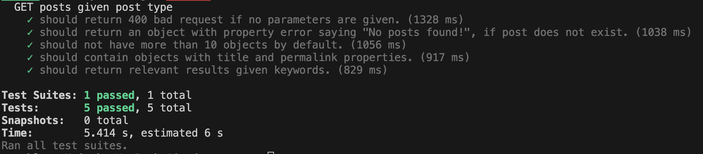
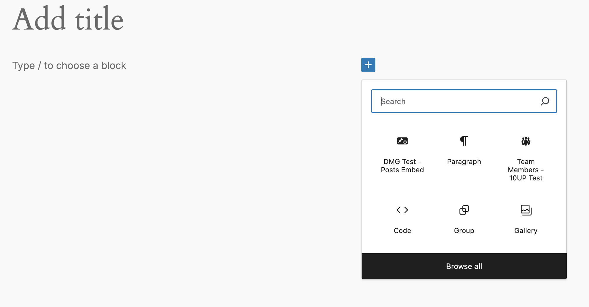
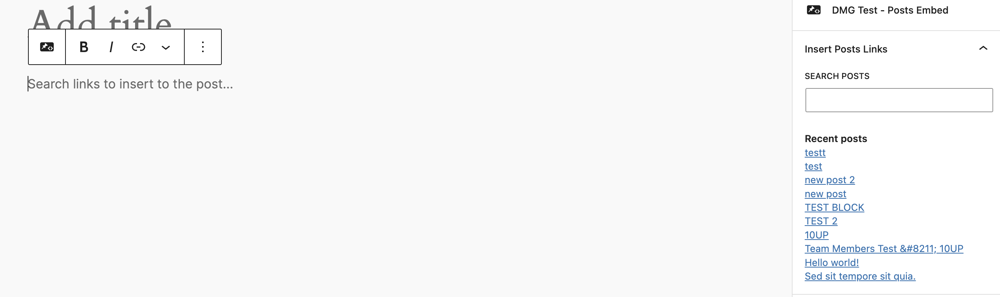
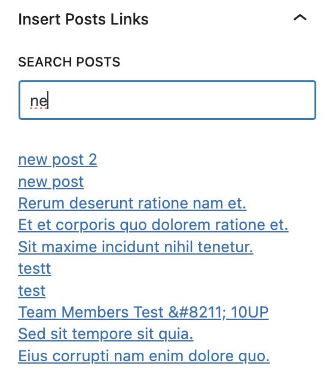
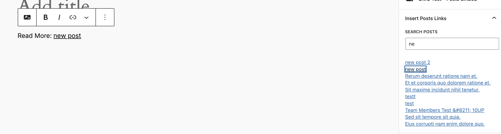

## Overview

A WordPress plugin developed to fulfil functional and non-functional requirements for test assignment requested by DMG. 

1. Implements a Component with following functional requiremnets
    - To allow a user to search for posts.
    - To display most recent posts by default.
    - To allow a user to insert a post into the core/paragraph block. 

2. Implements WP CLI sub command with following functional requirements
    - To allow for date-after and date-before arguments to search posts. 
    - Queries for posts which contains 'dmg-test/posts-embed' gutenberg component.
    
    (Assumed):
    - To have a paginated system if the resultant posts are more than posts_per_page. 
    - To validate the date ranges.
    - To only allow dd/mm/yyyy.

## Developer Notes

1. **API Implementation:**
```/classes/class-api.php``` contains the implementation for the API including, registeration of rest route using ```register_rest_route```.

2. **Search command** ```/classes/class-search-command.php``` contains the implementation for the WP CLI sub-command.

3. **Component** ```/src/dmg-posts``` contains the implementation of the component using React / Gutenberg comopnents. The block is registered using ```block.json```. 

4. **Tests** ```/tests/``` contains all the tests written to be executed with [JEST](https://jestjs.io/). 


### Requirements for development process
A Unix based shell is recommended with latest node version. Plugin has been tested on 
- Node version 21.7.2
- NPM version 10.5.0

Install node modules using 
```npm install``` before running any development process. 


### Development processes

1. **Test** ```npm run test``` - uses JEST. 

    ***Expected output:*** 

2. **Build** ```npm run build``` - uses wp-scripts to compile the JS files. 

## Usage

To use any of the features plugins must be installed and activated in WordPress.

### Component

```dmg-test/posts-embed``` is a gutenberg based component which will allow to search and insert posts links in a WordPress post or page. 

**Step 1.**

In gutenberg editor find the component by searching the keyword "dmg".



**Step 2.**

Add the component to the gutenberg editor.

 By default it will show recent posts which can be selected. 



**Step 3.**

Search and insert the link to the post. 





### WP_CLI Command

```dmg-read-more search``` allows the user to get a list of post from post type 'post'. Accepts two associative arguments as follows:
    
1. ```--date-before``` - This filters and retrieves all the posts before the given date. 
2. ```--date-after``` - This filters and retrieves all the posts after the given date. 

**Note:** 
- ```dd\mm\yyyy``` is the only accepted format for the date. 
- Command will not work if the date range is invalid I.e., if after-date is after before-date. 


#### Example:
```wp dmg-read-more search --date-after=01/01/2020 --date-before=02/01/2024```

Aforementioned command will retrieve the posts between 01/01/2020 and 02/01/2024.


## Critical Evaluation and Considerations
- It is recognised that the API does not support pagination and as a result the component will only be limited to display the maximum posts_per_page as defined in the API callback method.

- It is also understood that the testing is limited to API and does not cover the component or WP CLI subcommand. 

- No OpenAPI specification.

- No authentication has been implmented for API.

- Have scope for performance optimisations in API response times. 

